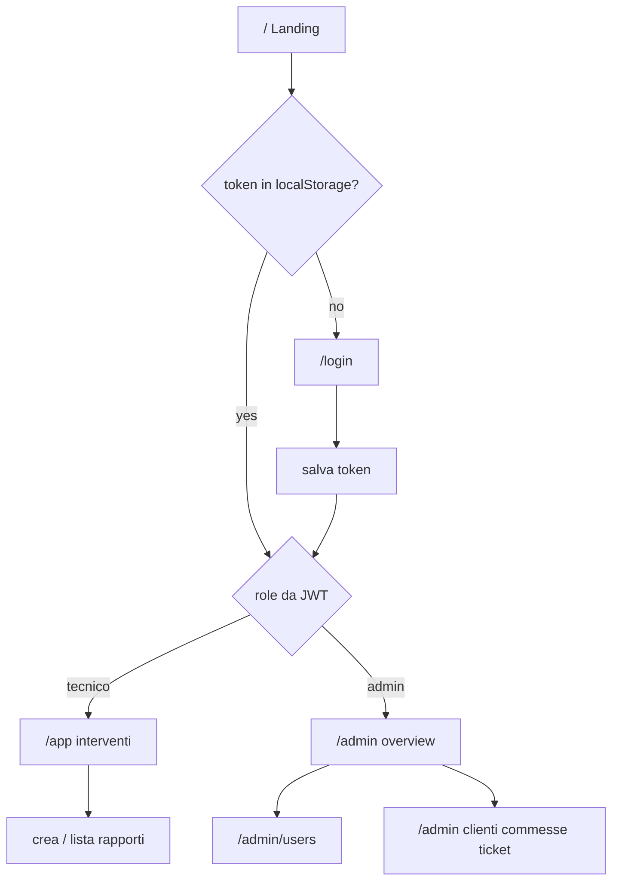

# Frontend guide — Rapportini

Checklist di sviluppo della SPA React. L’autore implementa un pezzo alla volta; l’IA fa da tutor/review.

Stack: React + Vite, JS, CSS plain (variabili in `frontend/src/index.css`), `fetch`, `react-router-dom`, auth con Context + JWT in `localStorage`.

## Architettura (auth, router, ruoli)

Il **flusso di pagine** è nel frontend (react-router). I ruoli decidono **cosa mostrare e dove navigare**. L’autorizzazione vera resta nell’**API** (403 se un tecnico chiama un endpoint admin).

| Pezzo | File tipici | Responsabilità |
|-------|-------------|----------------|
| Auth state | `frontend/src/auth/AuthContext.jsx` | token in `localStorage`; espone `user` (`id`, `role`), `login`, `logout` |
| Ruolo | payload JWT (`sub`, `role`) da `backend/auth.py` | decodificare il payload (segmento centrale base64, **senza** verificare la firma in UI) per `user_id` / `role`; l’API verifica sempre il JWT |
| Guard token | `frontend/src/auth/RequireAuth.jsx` | no token → redirect `/login` |
| Guard admin | `frontend/src/auth/RequireAdmin.jsx` | `role !== "admin"` → redirect area tecnico |
| Router | `frontend/src/main.jsx`, `frontend/src/App.jsx` | route + wrapper `AuthProvider` |
| API | `frontend/src/api.js` | `login` già presente; aggiungere `apiFetch` con `Authorization: Bearer …` |

Non spargere controlli di ruolo nei form: un solo AuthContext + due guard. Le pagine usano `useAuth()`.

**Landing:** pubblica, minimale (brand + CTA Accedi). Se c’è già un token, `/` reindirizza all’home del ruolo (`/app` o `/admin`).

**Impaginazione**

- **Tecnico** — lista interventi propri; crea/modifica (cliente, ticket opzionale, ore, data); anagrafiche in sola lettura per le select.
- **Admin** — shell con nav: Utenti | Clienti | Commesse | Ticket | Materiali | (poi Stats); route figlie sotto `/admin`.
- **Stats/grafici** — dopo i CRUD (es. Recharts); endpoint aggregati solo se servono.

## Mappa route

| Path | Accesso | Contenuto |
|------|---------|-----------|
| `/` | pubblico | Landing; redirect se autenticato |
| `/login` | pubblico | Form login |
| `/app` | autenticato (tecnico; admin può entrarci) | Home tecnico / interventi |
| `/app/interventi/nuovo` | autenticato | Crea intervento |
| `/app/interventi/:id` | autenticato | Dettaglio / modifica intervento |
| `/admin` | solo admin | Overview admin |
| `/admin/users` | solo admin | CRUD utenti |
| `/admin/clienti` | solo admin | CRUD clienti |
| `/admin/commesse` | solo admin | CRUD commesse |
| `/admin/ticket` | solo admin | CRUD ticket |
| `/admin/materiali` | solo admin | CRUD materiali (+ utilizzati) |

Dev: Vite `http://localhost:5173` → API `http://localhost:8000` (CORS già whitelist). Bench throwaway: `test/index.html` via `/bench` — non è il frontend.

## Checklist

### Fase A — Fondamenta

- [ ] Installare `react-router-dom` in `frontend/`
- [ ] `AuthContext` + token in `localStorage`
- [ ] Decodifica JWT → `user_id` / `role`
- [ ] `apiFetch` con header Bearer
- [ ] Route: `/`, `/login`, guard `RequireAuth`

### Fase B — Auth UI

- [ ] Landing (`/`)
- [ ] Login form (usa `login()` in `api.js`)
- [ ] Logout
- [ ] Redirect post-login in base al ruolo (`tecnico` → `/app`, `admin` → `/admin`)

### Fase C — Area tecnico (`/app`)

- [ ] Layout tecnico
- [ ] Lista interventi
- [ ] Crea / modifica intervento
- [ ] Select cliente (e ticket opzionale) in lettura

### Fase D — Area admin (`/admin`)

- [ ] Layout + nav
- [ ] CRUD utenti
- [ ] CRUD clienti
- [ ] CRUD commesse (con lat/lon)
- [ ] CRUD ticket
- [ ] CRUD materiali + materiali utilizzati

### Fase E — Plus

- [ ] Stats / grafici (Recharts)
- [ ] Filtri data (quando l’API li espone)
- [ ] Build prod + eventuale serve statico da FastAPI
- [ ] Rimuovere o isolare bench `/bench`

## Note

- Backend = source of truth su permessi; la UI nasconde, non protegge da sola.
- HTTPS/TLS al deploy (reverse proxy), non nel codice business.
- Admin seed locale: `admin` / `admin` (solo se non esiste già un admin).
- Semplicità: niente Redux, niente UI kit pesante; CSS variables già definite.
- Lavorare una checkbox alla volta; review in chat prima di accumulare pezzi.
