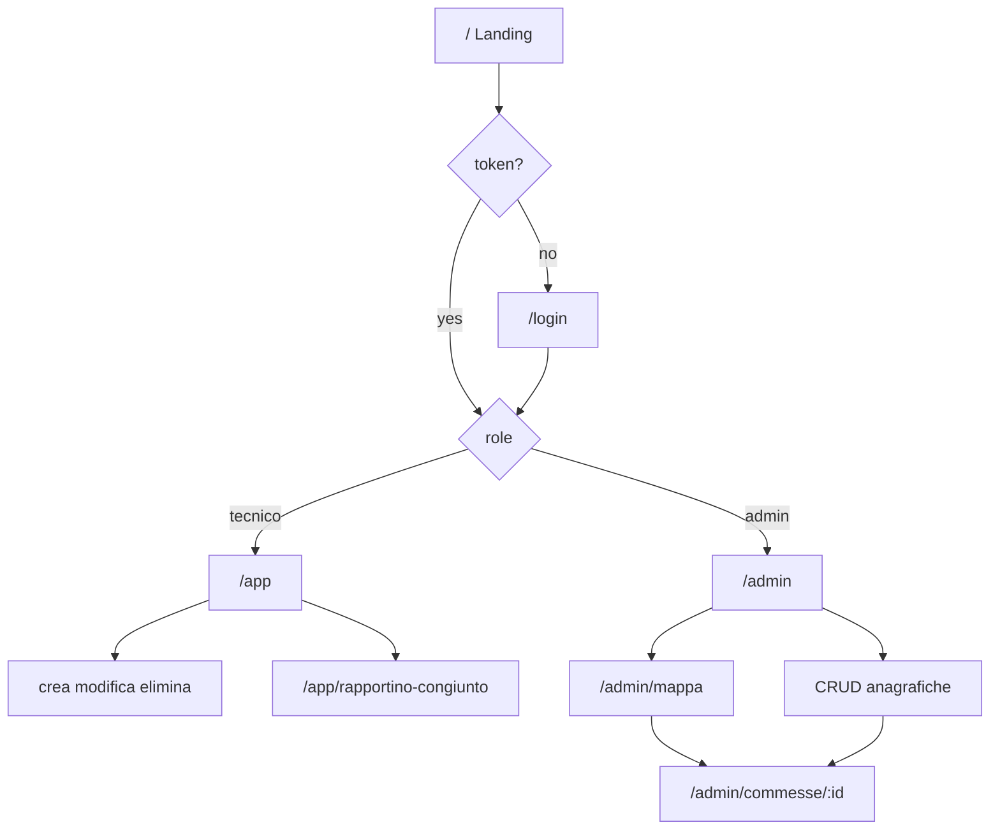

# Frontend guide — Rapportini

Checklist di sviluppo della SPA React. L’autore implementa un pezzo alla volta; l’IA fa da tutor/review.

Stack: React + Vite, JS, CSS plain (variabili in `frontend/src/index.css`), `fetch`, `react-router-dom`, auth con Context + JWT in `localStorage`. Brand: **TEC Energie**.

## Qualità UI (obbligatoria)

Il prodotto è per **TEC Energie**: deve risultare **extra professionale, premium e semplice**.

| Fare | Evitare |
|------|---------|
| Palette di sistema (`--color-*` in `index.css`), tipografia coerente (Manrope) | Stili “da template”, viola/glow, card ovunque, clutter |
| Poche azioni chiare, gerarchia forte, spazi generosi | Troppi bottoni, badge, widget decorativi |
| Brand visibile (logo su fondo scuro: wordmark ha «TEC» bianco) | Logo su platinum senza contrasto |
| Form e tabelle sobrie, feedback errore discreto | Animazioni rumorose, effetti gratuiti |
| Stesso linguaggio visuale tra Landing, Login, App, Admin | Ogni pagina con uno stile diverso |
| **Tutti i messaggi utente in italiano** (errori, label, vuoti, conferma) | Stringhe inglesi in UI (`Forbidden`, `Failed to fetch`, ecc.) |
| **Responsive: telefono e PC** (layout, tap target, form, tabelle) | UI pensata solo desktop; testo tagliato o scroll orizzontale inutile su mobile |

L’app sarà usata **sia da smartphone sia da PC**. Ogni schermata va verificata su viewport stretti.

**Errori:** tradurre i `detail` API in `api.js` (`DETAIL_IT` / `detailToItalian`). Preferibile a regime italianizzare anche il backend.

## Architettura (auth, router, ruoli)

| Pezzo | File tipici | Responsabilità |
|-------|-------------|----------------|
| Auth state | `src/auth/AuthProvider.jsx` + `useAuth.js` + `auth.js` | token in `localStorage`; `user` (`id`, `role`), `login`, `logout`; context e hook in `useAuth.js` (fast refresh) |
| Ruolo | payload JWT (`sub`, `role`) | `parseJwt` in UI; l’API verifica sempre il JWT |
| Guard token | `src/auth/RequireAuth.jsx` | no token → `/login` (`Outlet`) |
| Guard admin | `src/auth/RequireAdmin.jsx` | `role !== "admin"` → `/app` |
| Header | `src/components/AppHeader.jsx` | brand, ruolo, Esci; nav sezioni se admin |
| Router | `src/App.jsx` | route + `AuthProvider` in `main.jsx` |
| API | `src/api.js` | `login`, `apiFetch` + Bearer + messaggi IT |

## Mappa route

| Path | Accesso | Stato |
|------|---------|-------|
| `/` | pubblico | Landing brand TEC Energie |
| `/login` | pubblico | Form login + redirect per ruolo |
| `/app` | autenticato | Lista interventi, filtri, selezione, CRUD azioni |
| `/app/interventi/nuovo` | autenticato | Crea intervento |
| `/app/interventi/:id` | autenticato | Modifica intervento (stesso form, «Aggiorna») |
| `/app/rapportino-congiunto` | autenticato | Revisione multi-intervento; conferma PDF stub → `/app` |
| `/admin` | solo admin | Lista interventi di tutti (stessa `AppHome`, + colonna/filtro Tecnico) |
| `/admin/interventi/nuovo`, `/admin/interventi/:id` | solo admin | Stesso form tecnico + select Tecnico |
| `/admin/rapportino-congiunto` | solo admin | Stessa revisione dei tecnici |
| `/admin/utenti` | solo admin | CRUD utenti |
| `/admin/clienti` | solo admin | CRUD clienti |
| `/admin/commesse` | solo admin | Lista + spese/residuo; crea → dettaglio |
| `/admin/commesse/:id` | solo admin | Dettaglio: budget − spese, ticket, materiali; modifica con picker mappa |
| `/admin/mappa` | solo admin | Mappa (Leaflet + OSM); etichetta nome colorata per stato; click → dettaglio |
| `/admin/ticket` | solo admin | CRUD ticket; `?commessa=` prefiltra |
| `/admin/materiali` | solo admin | CRUD catalogo |
| `/admin/materiali-utilizzati` | solo admin | Materiali su commessa; `?commessa=` prefiltra |

Dev: Vite `:5173` → API `:8000` (CORS). Bench: `http://127.0.0.1:8000/bench`.

## Area tecnico — comportamento attuale

- Lista: righe a **scroll orizzontale** (niente sticky che copre i dettagli su mobile).
- Filtri client-side: **cliente**, **data da / data a**; sort **data | cliente** × **ASC | DESC**.
- Form intervento: cliente obbligatorio; commessa/ticket opzionali a cascata (`/clienti` → `/clienti/:id/commesse` → `/commesse/:id/ticket`).
- Campi ore: `ore_lavorate` (>0), `ore_viaggio`, `km`; `ore_totali` = lavorate + viaggio; `note` opzionale.
- Rapportino congiunto: checkbox → revisione + totali + avvisi → conferma operatore → (PDF futuro) ora solo redirect home.

## Area admin — comportamento attuale

- Stesse pagine interventi dei tecnici su `/admin…`, senza filtro “solo me”: vedi **tutti**; filtro utente elenca **tutti gli utenti** (admin etichettati `(admin)`).
- Form nuovo/modifica intervento: select **Tecnico** obbligatorio.
- Nav: Interventi | Mappa | Utenti | Clienti | Commesse | Ticket | Materiali | Materiali utilizzati.
- **Mappa** (`map.js` + Leaflet): punto = stato budget se `in_corso` (neutro/rosso) o grigio se chiusa; **nome** sempre sopra il punto (verde / grigio / rosso = `in_corso` / `completata` / `annullata`); click punto o nome → dettaglio.
- **Dettaglio commessa**: `GET /commesse/{id}` + ticket + materiali; spese da riepilogo; link a ticket/materiali con `?commessa=`.
- **Form commessa**: `MapPicker` + lat/lon a mano (`CommessaForm.jsx`).
- Ticket: `costo_totale` **solo lettura** (trigger DB); non nel body create/update.

## Checklist

### Fase A — Fondamenta

- [x] Installare `react-router-dom`
- [x] `AuthProvider` + token in `localStorage`
- [x] Decodifica JWT → `id` / `role`
- [x] `apiFetch` con Bearer + errori IT
- [x] Route `/`, `/login`, guard `RequireAuth`

### Fase B — Auth UI

- [x] Landing
- [x] Login form
- [x] Logout
- [x] Redirect post-login per ruolo

### Fase C — Area tecnico (`/app`)

- [x] Layout tecnico (header brand)
- [x] Lista interventi + filtri/sort
- [x] Crea / modifica / elimina intervento
- [x] Select cliente / commessa / ticket in cascata
- [x] Rapportino congiunto (revisione; PDF stub)

### Fase D — Area admin (`/admin`)

Più articolata della fase tecnico: anagrafiche con vincoli FK, geo su commesse, ruoli utente.

- [x] `RequireAdmin` + redirect se non admin
- [x] Header con **nav** admin (Interventi | Mappa | Utenti | Clienti | Commesse | Ticket | Materiali | Materiali utilizzati)
- [x] Interventi admin: stesse pagine dei tecnici, tutti gli utenti (filtro include admin), select Tecnico nel form
- [x] CRUD utenti (`role`, `costo_orario`; password solo in create per ora)
- [x] CRUD clienti
- [x] CRUD commesse (lat/lon obbligatori, stato, budget, date) + picker posizione su mappa
- [x] Mappa commesse: punto budget (neutro/rosso/grigio) + etichetta nome per stato (verde/grigio/rosso)
- [x] Dettaglio commessa: riepilogo economico (`GET /commesse/riepilogo`), tabelle ticket e materiali
- [x] CRUD ticket (sotto commessa, filtro/`?commessa=`); `costo_totale` da trigger DB
- [x] CRUD materiali + materiali utilizzati su commessa (`?commessa=` dal dettaglio)
- [x] Coerenza UI con area tecnico (stessi token CSS / header)
- [x] `useAuth` in file separato da `AuthProvider` (lint react-refresh)
- [ ] Backend: `UniqueViolation` su `nome` commessa/ticket → 409 (oggi 500 con messaggio grezzo)
- [ ] `users_positions`: nessun endpoint di lettura — rinviato alla fase GPS

Fase D sostanzialmente chiusa; restano i due punti backend sopra.

### Fase E — Plus

- [ ] PDF rapportino congiunto (hook già in UI)
- [ ] Stats / grafici (Recharts)
- [ ] Filtri avanzati lato API (se servono per performance)
- [ ] Build prod + serve statico da FastAPI
- [ ] Isolare / rimuovere bench `/` (tenere `/bench`)

## Note

- Backend = source of truth su permessi.
- Admin seed: `admin` / `admin` (solo se non esiste già un admin).
- Semplicità: niente Redux / UI kit pesante. Unica lib mappa: `leaflet` usato diretto (no `react-leaflet`); `map.remove()` nel cleanup (StrictMode).
- `GET /commesse/riepilogo` deve stare **prima** di `/commesse/{id}` in FastAPI, altrimenti “riepilogo” viene letto come id.
- `ticket.costo_totale` = Σ `ore_totali × costo_orario` degli interventi del ticket: trigger su `interventi` e su `users.costo_orario` (tariffa **attuale**, non storica). Interventi senza ticket non pesano su nessuna commessa.
- Palette: `--color-success` (verde) per nomi/stati `in_corso` sulle etichette mappa.
- File utili admin: `src/map.js`, `src/components/MapPicker.jsx`, `src/pages/admin/commesse.js`, `CommessaForm.jsx`, `AdminMappa.jsx`, `AdminCommessaDettaglio.jsx`.
- Lingua UI: **solo italiano**; device: **mobile + desktop**.
- Lavorare una checkbox alla volta; review in chat.
